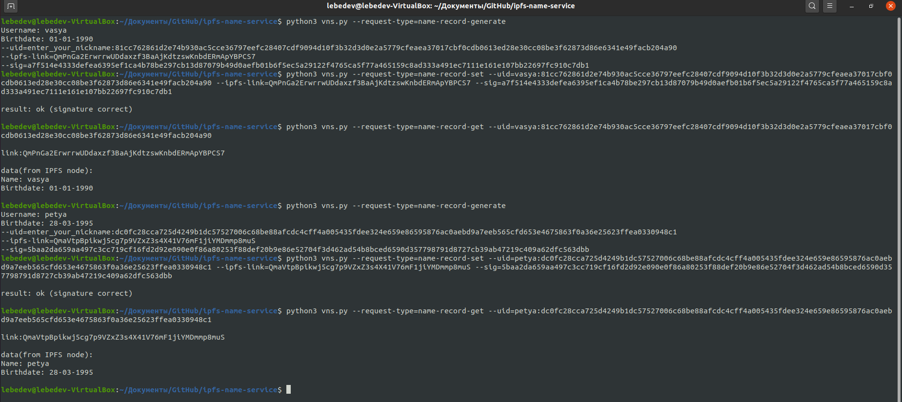

# Name-сервис IPFS-ссылок пользователей 

## Описание программы
Программа VNS (Vasya Name Service) реализует name-сервис для создания профилей пользователей в IPFS. Это сервис, в котором “именем” является комбинация “user_name + user_public_key”, а ответом на запрос по имени является IPFS-линк на данные о пользователе. При этом, user, владеющий секретным ключом от public key может обновить IPFS ссылку на свой профиль, отправив в сервис запрос на обновление, подписав новую ссылку своим секретным ключом.
https://park.mail.ru/curriculum/program/lesson/14833/#homework_5097

Программа поддерживает:
- работу с несколькими пользователями
- отображение данных о пользователе из IPFS при запросе

## Конфигурация
Первый аргумент, который программа получает на вход, указывает режим работы программы:
> --request-type=name-record-generate - режим генерации файла, публичного и приватного ключей пользователя, ipfs-link, ее подписи

> --request-type=name-record-set - режим добавления/обновления name-record для пользователя

> --request-type=name-record-get - режим запроса ipfs-link по пользователю

## Сборка
Собирать проект не надо, достаточно клонировать данный репозиторий.
Однако перед запуском проекта необходимо:
> Установить go-ipfs (https://dist.ipfs.io/#go-ipfs)

> Инициализировать локальную ipfs-ноду командой `ipfs init`

> Запустить ipfs-ноду командой `ipfs daemon`

## Запуск
### Режим генерации
В данном режиме запускается ipfs-нода, в нее записывается файл с данными о пользователе (данные вводятся с клавиатуры), генерируется пара ключей пользователя, а также подпись ipfs-link.

Для запуска проекта в режиме генерации напишите:
> python3 vns.py --request-type=name-record-generate

После этого вводите с клавиатуры информацию, которая будет храниться в пользовательском файле.

### Режим добавления/обновления
Добавляет запись в name-сервис

Для запуска проекта в режиме добавления/обновления напишите (без "<, >"):
> python3 vns.py --request-type=name-record-set --uid=<user_id:pubkey> --ipfs-link=<user_ipfs_link> --sig=<user_ipfs_link_signature(format = hex)>

Например:
```
python3 vns.py --request-type=name-record-set 
--uid=vasya:84cda068d7881ad991c330d21cae510bc3364a1299a41c9d8e1c5a9b0bc838aabaf3ade8b353493201215d4603e84b9fc3e1cd2f6747fc2b1c967d2a216770fe 
--ipfs-link=a16991c90fc509a9bb31f9b89d12afc5e9d1badb591a622c49c76e3f8b159cc1 
--sig=e0b606ad50b29516c2214e599c07c557eb0a7bbe47952a9f4d3ea84ba9c64308f184b2fcc47b514daad847507bbaa748a9ba9ca34735ca20ce5bfa720c71932e
```

### Режим запроса
Выводит ipfs-link по заданному пользователю, а также данные из ipfs-link

Для запуска проекта в режиме запроса напишите (без "<, >"):
> python3 vns.py --request-type=name-record-get --uid=<user_id:pubkey>

Например:
```
python3 vns.py --request-type=name-record-get 
--uid=vasya:84cda068d7881ad991c330d21cae510bc3364a1299a41c9d8e1c5a9b0bc838aabaf3ade8b353493201215d4603e84b9fc3e1cd2f6747fc2b1c967d2a216770fe 
```

### Пример запуска, работы программы


## Используемые несистемные библиотеки
ecdsa (https://pypi.org/project/ecdsa/)

ipfs-api (https://pypi.org/project/ipfs-api/)
